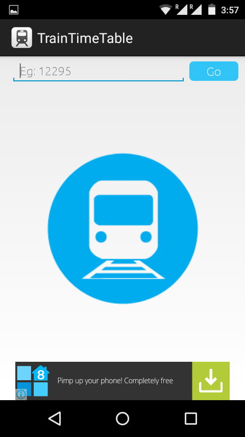
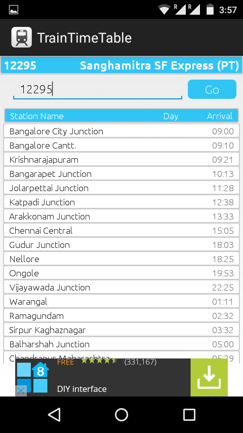

<h2 align="center"><b>Offline Train Time Table</b></h2>
<h4 align="center">Get Indian railways train time table without internet.</h4>

## Offline Train Time Table

Get the offline train time table and access all trains schedule without the need of internet. 

## Getting Started

_Follow these instructions to build and run the project.._

1. Clone this repository.
3. [Install Android Studio](https://developer.android.com/sdk/index.html).
5. Import the project. Open Android Studio, click `Open an existing Android
   Studio project` and select the project. Gradle will build the project.
6. Run the app. Click `Run`, then choose `Run app`. After the project builds you'll be
   prompted to build or launch an emulator.

## Screenshots

   
   

## Contributing Guidelines

Read the contributing guidelines [here](https://github.com/arshadkazmi42/offline-train-time-table/blob/main/CONTRIBUTING.md)